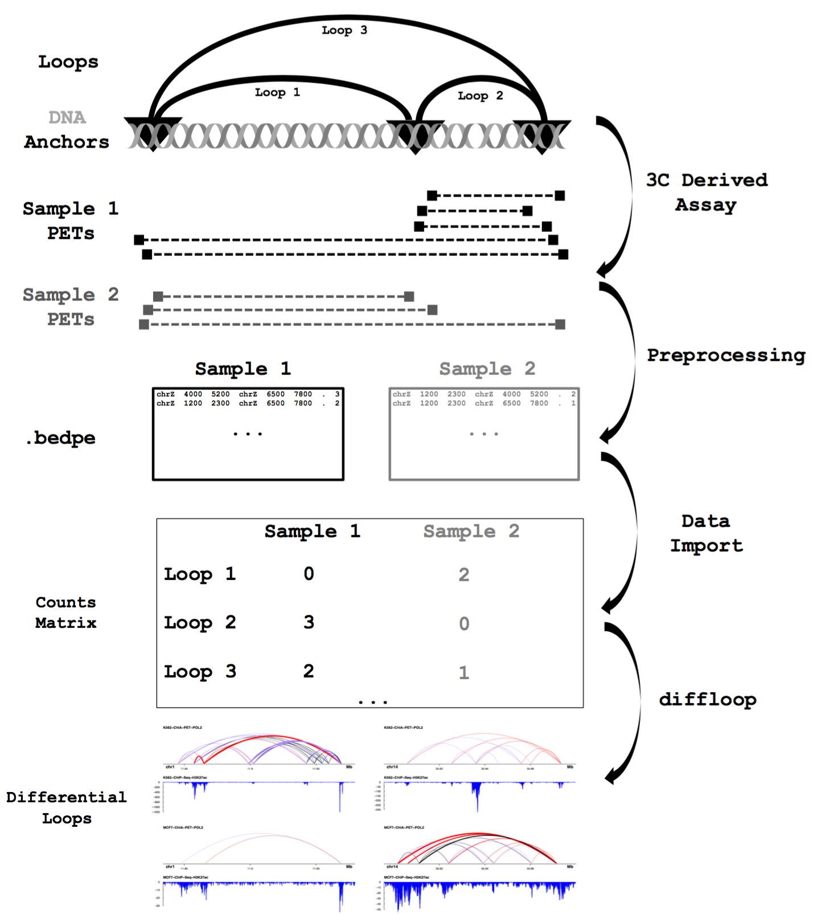

***

# Overview
The purpose of this document is to describe in greater detail much of the useful functionality implemented in `diffloop`, an `R/Bioconductor` package. As the name suggests, the goal of this package was to create a computational framework to identify differential loops between conditions akin to differential gene expression analyses from RNA-Seq and related transcriptomics data. However, much of the more useful methodology is incorporated *before* one runs differential association (_i.e._ quality control) and after differential loops are called (_e.g._ visualization, correlating differential loops with epigenomic signal and gene expression, etc.). This extended online resource provides a means for understanding these functions and seeing the exact flow of commands needed for a more integrative analysis. 


**Above:** High level overview of looping assays and analyses in workflows faciliated by `diffloop`.

Additional steps regarding the quality control ana analysis of similar ENCODE ChIA-PET data can be found [here](https://rpubs.com/caleblareau/diffloop_vignette). 


## On preprocessing

Though outside the scope of `diffloop`, an important component to consider before using this package is the choice of preprocessing associated with the loop data. For this vignette, we used the [mango](https://github.com/dphansti/mango) ChIA-PET pre-processing pipeline importantly specifying the `reportAllPairs = TRUE` flag such that any PET binding two peaks would be retained. However, it may be optimal to process the interaction set together, which requires pre-specifying anchor loci. To this end, we recommend an in-house tool, [hichipper](https://aryeelab.org/hichipper), which enables this and other HiChIP-specific methods.

Regardless of the choice of preprocessing, some basic assumptions about the anchor size have to be made. In most Hi-C pre-processing pipelines, a fixed genome window of 5kb, 20kb, or similar distance is employed. From what we've seen using preprocessing tools, most support some fixed-width padding around a `.narrowPeak` file that is called from `macs2` or a similar peak-caller when an immunoprecipitation is used (in HiChIP and ChIA-PET). Tools such as `mango` and `hichipper` use 500-1,000 bp as anchor pads, though users should consider the question of interest before selecting window padding, etc., for their experimental system. While `diffloop` has functionality to enable anchor padding, in general, this is best employed early in the pre-processing steps using the flags made available in these and other tools. 

## On single-replicate samples 

Akin to `DESeq`, `edgeR`, and related RNA analysis frameworks, replicate samples are essentially *required* to accurately identify differential loops with statistical confidence. However, one can certainly utilize `diffloop` to identify putative differential loops in single replicate settings. For example, suppose you had a `loops()` object called `dat` with 2 samples that that you wanted to compare against each other. While the assumptions needed for variance estimation in the loop counts make computing a p-value or FDR per-loop impossible as we will demonstrate later with replicates, we'd advice the following workflow for find differential loops in single-replicate settings.

```{r singles, eval=FALSE, message=FALSE, warning = FALSE}
dat <- loopsMake("../loopsdata")
dat@rowData$diffCount <- dat@counts[,2] - dat@counts[,1] # per loop differences between sample 1 and 2
df <- summary(dat)
```

**Note:** above are real diffloop commands but are not executable in the lense of the vignette. 

In the code above, the idea is to add a column to the `rowData` slot that is the difference in counts per loop between sample 2 and sample 1, which may be informative for finding differential loops between the two samples. the `summary` command in `diffloop` (when applied to a `loops()` object) results in a `data.frame` of useful information per loop where users can now sort `df` by the `diffCount` column much like any other `data.frame` in R. Again, while single replicate conditions are certainly sub-optimal, we suggest this framework for a simple first pass in this setting. 

## On sample normalization and GC Bias

The extent to which GC-bias and other confounding variables bias differential loop calls has not yet been explored in hierarchical chromatin interation data. As models for correcting GC-bias are still evolving for more widely used assays such as RNA-seq and relatively few chromatin looping datasets exist, it is challenging presently to posit a generalized effect of these biases on differential loop calls. While various model-based approaches have been suggested for Hi-C data, analogs for ChIP-based looping assays have not been well established. We note that `diffloop` currently corrects only for variable library size. However, we anticipate expanding the functionality of the package as these methods for bias correction and looping data become more available.  

## Sample analysis of ENCODE ChIA-PET data / preprocessing

For the remaining contents of this document, we primarily discuss the analysis framework associated with a sample comparison of differential looping between the MCF7 and K562 cancer cell lines. ChIA-PET data made available through the ENCODE project were analyzed using the following workflow--

The raw `.fastq` read files for the POL2 data were preprocessed with the [mango](https://github.com/dphansti/mango) package, an R package that relies on bowtie, bedtools, and MACS2 to align reads, call anchor peaks, and summarize PETs per sample in the ChIA-PET experiment.

```
head -3 *.interactions.all.mango
```
yields-- 
```
chr1    32705184    32708527    chr1    32712484    32715408    4   1
chr1    32705184    32708527    chr1    32755920    32759477    3   1
chr1    32705184    32708527    chr1    32799616    32803060    6   1
```

Another possible format for reads are `.bedpe` files, which are very similar to the output files produced by mango. To use the loopsMake function from a different preprocessing step, have files X.loop_counts.bedpe,Y.loop_counts.bedpe, Z.loop_counts.bedpe in bed_dir for samples = (X,Y,Z) where the first lines should resemble:

```
head -3 *.loop_counts.bedpe
```
yields--
```
1 10002272 10004045 10 120968807 120969483 . 1
1 10002272 10004045 10 99551498 99552470 . 1
1 10002272 10004045 1 10002272 10004045 . 17
```

where the first three columns specify the position (chr:start:stop) of the first anchor, the second three columns specify the position (chr:start:stop) of the secnd anchor, the 7th column is “.” and the 8th column is the number of paired-end reads support that particular PET.

For this vignette, we use the `.mango` output files. 

## Difference between mango and diffloop

Most software for chromatin confirmation capture data like `mango` and `juicer` are focused on identifying whether or not a loop is real in a single sample form sequencing data. "Real" here simply means that the observed contact frequency from sequencing depth is greater than one would expect by chance. "Chance" here typically means that given some distance between two points and the total depth at two points, a reasonable background can be considered for how many paired-end reads we'd expect by chance. 

In contrast, `diffloop` essentially assumes that one has settled on whether a loop is real or not (though `diffloop` does provide quality control measures to facilitate the interfence of this quality control) and provides functionality to understand what role these loops may play coordinating epigenetic and transcriptomic states and whether there is significant variance in the reads supporting loops in different conditions. To this end, these software packages meet very different needs. As the vignette unfolds, we hope to communicate the syngery between these tools. 

## Packages

First, we'll load all the necessary packages for this vignette overview--

```{r packages, cache=FALSE, message=FALSE, warning = FALSE}
library(diffloop)
library(GenomicRanges)
library(ggplot2)
```

## Data structures

We've created a novel `S4` `loops()` object that provides the backbone for housing data and is the input to virtually all functions shown here. Currently, `diffloop` functions only work on this type of object. [Email Caleb](mailto:caleblareau@g.harvard.edu) if you have your loops data in another format that is reasonably common in `R/Bioconductor` workflows and converting it to a `loops()` object isn't straightforward.

## Import / quality control

There are two main functions currently available in `diffloop` used to import loops. Examples of each are discussed [here](https://rpubs.com/caleblareau/diffloop_vignette), but for this vignette, we only use the `loopsMake.mango` function, which imports files that end in `.mango`. 

The nature of the cell lines that we are analyzing in this experimental setting necessitates that regions of the genome likely to be affected by cancer genome rearrangements and copy number alterations could bias differential looping results. To this end, we use the `removeRegion()` function can be called to filter loops that have one or more anchors in a particular region that may be blacklisted. While CNVs likely have some interesting effect on topology that should be explored in the future, we simply remove these regions to avoid a confounded signal where we mis-attribute an apparent difference in topology to a difference better explained by altered CNV.

After removing these regions with CNV alteration, we then will filter loops that are deemed biased from the mango Step 5 function. The diffloop implementation aggregates counts across all samples when apply the mango correction model. Here, we filter all loops with an FDR > 0.01 as implemented in the original mango software.

Finally, we filter loops using the `filterLoops()` function to ensure that loops have at least 2 PETs in at least 2 samples; this filtering step is akin to filtering out lowly expressed genes in RNA-Seq. Failing to do some level of filtering like this heavily influences the pooled variance estimations from `edgeR` and related tools.

The code chunk below shows the basic workflow for importing data and performing the quality control metrics discussed above, including the `dim()` of the loops objects at each filerting step so that one can readily see how loops and anchors get filtered out during this process--

```{r importQC, cache = FALSE, message=FALSE, warning = FALSE, cache = TRUE}
full <- loopsMake.mango("../data/raw_mango")
dim(full)
full <- updateLDGroups(full, c("K562", "K562", "MCF7", "MCF7"))
samples <- c("HCT116", "K562_r1", "K562_r2", "MCF7_r1", "MCF_r2")
long <- subsetLoops(full, full@rowData$loopWidth >= 5000) # remove and loops that merged together from import
dim(long)
# Remove regions of CNV
bedNames <- c("chr", "start", "end", "type")

k562.cnv <- makeGRangesFromDataFrame(
  setNames(read.table("../data/cnv/K562-CNV.bedLogR")[,1:4],bedNames),
  keep.extra.columns = TRUE)
mcf7.cnv <- makeGRangesFromDataFrame(
  setNames(read.table("../data/cnv/MCF7-CNV.bedLogR")[,1:4], bedNames),
  keep.extra.columns = TRUE)

cnv.regions <- union(mcf7.cnv[mcols(mcf7.cnv)$type != "normal"],
                     k562.cnv[mcols(k562.cnv)$type != "normal"])
noCNV <- removeRegion(long, rmchr(cnv.regions))
dim(noCNV)

# Filter Mango interactions
mangoSig <- mangoCorrection(noCNV)
dim(mangoSig)

qcLoops <- filterLoops(mangoSig, width = 5000, nreplicates = 2, nsamples = 2)
```

## Differential loop calling

For computing differential loops, `diffloop` offers a few different functions for performing statistical testing. Most simply, if the `groups` associated with the samples are correctly specified, one can simply use the `quickAssoc` or `quickAssocVoom` function to run either a negative-binomial regression or a t-test with precious weights as these have previously been implemented in other tools. For greater specificity, the `loopsAssoc()` function provides more user interaction and specification for association. In a simple 2 x 2 test association, either of the `quickAssoc` functions should work well. For all differential testing in the remainder of the vignette, we use the `quickAssoc()` function as needed to compute differential loops. We've also performed a more detailed analysis of different modifications to the basic loop association contained in the .pdf on the previous page. However, as their are relatively few datasets with DNA loops, users are advised to carefully consider modifications to their system as these have not been extensively tested in a variety of settings. 

## Modified FDR Calculations

Though the following section hasn't been fully examined, note that the differential loop calling may be biased depending on whether the loops are long/short or perhaps a function of another covariate. To this end, we recommend using the [IHW package](http://bioconductor.org/packages/release/bioc/html/IHW.html) for computing modified false-discovery rates. Given a `loops()` object named `assoc` with a similar 2x2 design, one can run `IHW` and incorporate the results into the `loops` object using a workflow like so--

```{r ihw, warning = FALSE, message = FALSE, eval = FALSE}
library(IHW)
library(DESeq2)

# Do DESeq2 for IHW / FDR 
dsdLoop <- DESeqDataSetFromMatrix(
  countData=assoc@counts,
  colData=assoc@colData,
  design=~ c("type1", "type1", "type2", "type2") )
dsdLoop <- DESeq( dsdLoop )
resLoop <- as.data.frame( results( dsdLoop ) )
resLoop$var <- rowVars( counts(dsdLoop, normalized=TRUE) )

resLoop$edgePval <- assoc@rowData$PValue
resLoop$varGroup <- groups_by_filter(resLoop$var, 6)
ihwRes <- ihw( resLoop$edgePval ~ resLoop$var, alpha=0.1 )

assoc@rowData$IHWadjP <- ihwRes@df$adj_pvalue
diffLoops <- subsetLoops(assoc, assoc@rowData$IHWadjP < 0.1)
```

**Note:** this code is not executed in the analysis. Here, we condition of the variance of the loops using `DESeq2` and suggest that the differential loops called should be independent of the variance. Again, this is just one example for how one can compute modified false discovery rate statistics conditioned on some feature of the loops. This has been only gingerly tested internal to our lab, but other options worth considering may also include the loop width, which would be replaced in the `ihw` function call above. 

## Integration with other epigenomic data

In this section, we walk through an overview of how to incorporate additional forms of epigenetic data in `diffloop`, which includ DNA Methylation, ChIP-Seq, and DNase hypersensitivity. In general, we use these data to 1) annotate and characterize loops and 2) relate epigenetic signal near anchors to other effects in three-dimensional proximity though distal in the linear genome. 

### Annotating loops

Critical functionality in downstream `diffloop` analyses requires the annotation of loops. In particular, we annotate loops based on their assumed transcriptional activity by annotating the loops object with regions of promoters and enhancers. Here, we import enhancers defined by H3K27ac peaks in either cancer sample and use the RefSeq hg19 annotation transcription start sites padded by 1kb as the promoter regions.

At the bottom of this code chunk, a four panel figure showing loops plotted against variable epigenetic marks is rendered and the code below provides four slightly redudant lines of executables to produce this figure. For each, a simple linear regression is fit between the log2 fold change of DNA looping data and epigenetic data between the two conditions, which signifies the break in the analysis of that particular data type. Variations of the `annotateAnchors` function provides the ability to import these epigenetic markings and facilitates their analysis with the loops() object. 

```{r annotate, warning = FALSE, message = FALSE, eval = TRUE}
kh3 <- "../data/annotation/K562_H3K27ac.bed"
mh3 <- "../data/annotation/MCF7_H3K27ac.bed"

h3k27ac.k <- rmchr(padGRanges(bedToGRanges(kh3), pad = 1000))
h3k27ac.m <- rmchr(padGRanges(bedToGRanges(mh3), pad = 1000))

enhancer <- union(h3k27ac.m, h3k27ac.k)
promoter <- padGRanges(getHumanTSS(), pad = 1000)
km_anno <- annotateLoops(quickAssoc(qcLoops), enhancer = enhancer, promoter = promoter)
```

### Epigenetic correlates

```{r correlation plot, fig.height=10, fig.width = 10, cache = TRUE, warning = FALSE, message = FALSE}
library(reshape2)
library(cowplot)

######## A -- Chromatin accessibility
km_res <- quickAssoc(qcLoops)
km_res <- annotateAnchors.bigwig(km_res, "../data/bigwigs/K562-DNase.bw")
km_res <- annotateAnchors.bigwig(km_res, "../data/bigwigs/MCF7-DNase.bw")

# Annotate anchors; link anchors together and take the max
log2FC.dnase <- log2(mcols(km_res@anchors)$MCF7.DNase/mcols(km_res@anchors)$K562.DNase) 
log2FC.dnase <- log2FC.dnase - mean(log2FC.dnase, na.rm = TRUE)

mcols(km_res@anchors) <- as.data.frame(cbind(mcols(km_res@anchors), data.frame(log2FC.dnase)))
big.km.summary <- summary(km_res)

# Keep with largest absolute value
idx <- as.logical(abs(big.km.summary$log2FC.dnase_1) < abs(big.km.summary$log2FC.dnase_2))
idx[is.na(idx)] <- FALSE
diff.dnase.max <- as.matrix((sapply(1:length(idx), function(i) {
    if (idx[i]) {
        big.km.summary[i, ]$log2FC.dnase_2
    } else {
        big.km.summary[i, ]$log2FC.dnase_1
    }
})))
big.km.summary$diff.dnase.max <- as.numeric(diff.dnase.max)


# Bin data for boxplots
big.km.summary$diff.max.bin <- cut(big.km.summary$diff.dnase.max, seq(-12, 12, 3))

f31 <- ggplot(big.km.summary[complete.cases(big.km.summary), ]) + geom_hline(yintercept = 0) + theme_bw() + 
    ggtitle("Differential loops stratified by differential chromatin accessibility") + 
    geom_violin(aes(diff.max.bin, logFC), fill = "dodgerblue", trim = TRUE, scale = "width") +
    xlab("Max change in anchor log FC DNase binding") + ylab("log FC Loops")
summary(lm(data = big.km.summary, logFC ~ diff.dnase.max))

######## B -- Methylation
km_res <- quickAssoc(qcLoops)
km_res <- annotateAnchors.bed(km_res, "../data/450k-methyl/K562-450k.bedgraph")
km_res <- annotateAnchors.bed(km_res, "../data/450k-methyl/MCF7-450k.bedgraph")

# Annotate anchors; link anchors together and take the max
mcf7methyl <- mcols(km_res@anchors)$MCF7.450k
k562methyl <- mcols(km_res@anchors)$K562.450k
change.methyl <- mcf7methyl - k562methyl
log2FC.methyl <- log2(mcf7methyl / k562methyl)

mcols(km_res@anchors) <- as.data.frame(cbind(mcols(km_res@anchors), data.frame(cbind(log2FC.methyl, change.methyl))))
big.meth.summary <- summary(km_res)

# Keep with largest absolute value
idx <- as.logical(abs(big.meth.summary$change.methyl_1) < abs(big.meth.summary$change.methyl_2))
idx[is.na(idx) | is.nan(idx)] <- FALSE
diff.methyl.max <- as.matrix((sapply(1:length(idx), function(i) {
    if (idx[i]) {
        big.meth.summary[i, ]$change.methyl_2
    } else {
        big.meth.summary[i, ]$change.methyl_1
    }
})))
big.meth.summary$diff.methyl.max <- as.numeric(diff.methyl.max)
methyl.df <- big.meth.summary[, c("logFC", "diff.methyl.max", "FDR")]
methyl.df <- methyl.df[complete.cases(methyl.df) & !is.infinite(methyl.df$diff.methyl.max), ]

# Bin data for boxplots
methyl.df$diff.methyl.max.bin <- cut(methyl.df$diff.methyl.max, seq(-1, 1, 0.25))

f32 <- ggplot(methyl.df[complete.cases(methyl.df), ], aes(diff.methyl.max.bin, logFC)) +
    geom_violin(aes(diff.methyl.max.bin, logFC), fill = "firebrick", trim = TRUE, scale = "width") + 
    geom_hline(yintercept = 0) + theme_bw() + ggtitle("Differential loops stratified by differential methylation") + 
    xlab("Max change in anchor methylation") + ylab("log FC Loops")


summary(lm(data = big.meth.summary, logFC ~ diff.methyl.max))


####### C -- Cohesin localizaiton
km_res <- quickAssoc(qcLoops)
km_res <- annotateAnchors.bigwig(km_res, "../data/bigwigs/K562-RAD21.bw")
km_res <- annotateAnchors.bigwig(km_res, "../data/bigwigs/MCF7-RAD21.bw")

# Annotate anchors; link anchors together and take the max
log2FCrad21 <- log2(mcols(km_res@anchors)$MCF7.RAD21/mcols(km_res@anchors)$K562.RAD21)
log2FCrad21 <- log2FCrad21 - mean(log2FCrad21, na.rm = TRUE)
mcols(km_res@anchors) <- as.data.frame(cbind(mcols(km_res@anchors), data.frame(log2FCrad21)))
big.km.summary <- summary(km_res)

# Keep with largest absolute value
idx <- as.logical(abs(big.km.summary$log2FCrad21_1) < abs(big.km.summary$log2FCrad21_2))
idx[is.na(idx)] <- FALSE
diff.rad21.max <- as.matrix((sapply(1:length(idx), function(i) {
    if (idx[i]) {
        big.km.summary[i, ]$log2FCrad21_2
    } else {
        big.km.summary[i, ]$log2FCrad21_1
    }
})))
big.km.summary$diff.rad21.max <- as.numeric(diff.rad21.max)

# Bin data for boxplots
big.km.summary$diff.max.bin <- cut(big.km.summary$diff.rad21.max, seq(-6, 6, 2))

f33 <- ggplot(big.km.summary[complete.cases(big.km.summary), ], aes(diff.max.bin, logFC)) +
    geom_violin(aes(diff.max.bin, logFC), fill = "dodgerblue", trim = TRUE, scale = "width") + 
    geom_hline(yintercept = 0) + theme_bw() + ggtitle("Differential loops stratified by differential cohesin") + 
    xlab("Max change in anchor log FC RAD21 localization") + ylab("log FC Loops") 
summary(lm(data = big.km.summary, logFC ~ diff.rad21.max))

##### D -- K27ac signal
km_res <- quickAssoc(qcLoops)
km_res <- annotateAnchors.bigwig(km_res, "../data/bigwigs/K562-H3K27ac.bw")
km_res <- annotateAnchors.bigwig(km_res, "../data/bigwigs/MCF7-H3K27ac.bw")

# Annotate anchors; link anchors together and take the max
log2FC.H3K27ac <- log2(mcols(km_res@anchors)$MCF7.H3K27ac/mcols(km_res@anchors)$K562.H3K27ac)
log2FC.H3K27ac <- log2FC.H3K27ac - mean(log2FC.H3K27ac)
mcols(km_res@anchors) <- as.data.frame(cbind(mcols(km_res@anchors), data.frame(log2FC.H3K27ac)))
big.km.summary <- summary(km_res)

# Keep with largest absolute value
idx <- as.logical(abs(big.km.summary$log2FC.H3K27ac_1) < abs(big.km.summary$log2FC.H3K27ac_2))
idx[is.na(idx)] <- FALSE
diff.H3K27ac.max <- as.matrix((sapply(1:length(idx), function(i) {
    if (idx[i]) {
        big.km.summary[i, ]$log2FC.H3K27ac_2
    } else {
        big.km.summary[i, ]$log2FC.H3K27ac_1
    }
})))
big.km.summary$diff.H3K27ac.max <- as.numeric(diff.H3K27ac.max)


# Bin data for boxplots
big.km.summary$diff.max.bin <- cut(big.km.summary$diff.H3K27ac.max, seq(-6, 8, 2))

f34 <- ggplot(big.km.summary[complete.cases(big.km.summary), ], aes(diff.max.bin, logFC)) +
    geom_violin(aes(diff.max.bin, logFC), fill = "dodgerblue", trim = TRUE, scale = "width") + 
    geom_hline(yintercept = 0) + theme_bw() + ggtitle("Differential loops stratified by differential H3K27ac") + 
    xlab("Max change in anchor log FC H3K27ac") + ylab("log FC Loops")
summary(lm(data = big.km.summary, logFC ~ diff.H3K27ac.max))
plot_grid(f31, f32, f33, f34, ncol = 2, labels = c('A', 'B', 'C', 'D'), label_size = 20)

```

## Integration with transcriptome data

A core component of understanding the putative function of differential loops is the effect on transcription. Depending on the analysis that is desired, this can be quite tricky to integrate two very different data sets. However, we've provided some basic functionality for linking differential gene expression results from `DESeq2` to enhancer-promoter loops, detailed below. First, consider a rather straightforward analysis framework for performing differential gene expression analyses using `DESeq2`--

```{r deseq, warning = FALSE, message = FALSE, cache = TRUE}
library(DESeq2)

files <- grep("counts", list.files("../data/rna-seq/"), value = TRUE)
condition <- c("k562", "k562", "k562", "mcf7", "mcf7", "mcf7")
names <- c("k1", "k2", "k3", "m1", "m2", "m3")
sampleTable <- data.frame(sampleName = names, fileName = files, condition = condition)
dds <- DESeqDataSetFromHTSeqCount(sampleTable = sampleTable, directory = "../data/rna-seq/", design = ~condition)

dds <- dds[rowSums(counts(dds)) > 1, ]  #remove zero counts
dds$condition <- factor(dds$condition, levels = c("k562", "mcf7"))
dds <- DESeq(dds)
res <- results(dds)
res <- res[complete.cases(res), ]
resDESeq2 <- res[order(res$pvalue), ]
```

With the `DESeq2` data in a table, we can annotate enhancer-promoter loops with their corresponding gene expression values. To achieve this, sequential execution of the `keepEPloops()` and `annotateLoops.dge()` functions are required. This will add data in the rowData slot that has the transcriptional information associated with the particular loop when `multiple = FALSE`, as we show below.

```{r EPloops, warning = FALSE, message = FALSE}
km_res.ep <- keepEPloops(km_anno, enhancer, promoter)
km.linked <- annotateLoops.dge(km_res.ep, resDESeq2, multiple = FALSE)
```

If `multiple = TRUE`, then loops that bridge multiple promoters will be annotated with transcription values. To achieve this, the returning functional value cannot be a loops object since we have to duplicate the loop to accommodate the multiple promoters.

In this code chunk, we also set up a data frame for plotting global trends, including the methylation values at distal regions and promoter regions.

```{r binsExprs, warning = FALSE, message = FALSE}
df <- summary(km.linked)
df$logFC_bin <- cut(df$logFC, seq(-12, 12, 3))
df$log2FoldChange_bin <- cut(df$log2FoldChange, seq(-20, 20, 5))
```

We use our large data frame to visualize the relationship between increasing strength of enhancer-promoter loops and the increasing relative expression of transcripts that are linked to the loops.

```{r violinPlotExpression, warning = FALSE, message = FALSE, fig.width = 10}
loopViolin <- ggplot(df[complete.cases(df) & df$padj < 0.1, ], aes(logFC_bin, log2FoldChange)) + 
    geom_violin(aes(logFC_bin, log2FoldChange), fill = "dodgerblue", trim = TRUE, scale = "width") + 
    geom_hline(yintercept = 0) +  theme_bw() + 
    labs(title = "Differential expression stratified by E-P Loops", x = "log FC Loops", 
    y = "log FC Gene Expression")
loopViolin
```

The plot clearly shows a trend where increasing the logFC of the loops results in a corresponding logFC increase in the corresponding transcript that is the target of the enhancer-promoter loop. While there may be some degree of non-linearity in this plot, we suggest that analyzing more closely-related phenotypes may yield better insights into the role of differential loops on specific gene expression programs. 

## Loops + epigenetic + transcription data

Starting with our quality-control loops object, we can use functionality discussed above to view epigenetic correlations with gene expression values as mediated by loops. using functions above, we can link all three of these data types together in an effort to better characterize gene regulation at distal elements. Here's an example workflow for end-to-end analysis--


```{r trinity, warning = FALSE, message = FALSE, cache = TRUE, fig.height = 10, fig.width = 10}
km_full <- qcLoops
h3k27ac.k <- rmchr(padGRanges(bedToGRanges("../data/annotation/K562_H3K27ac.bed"), pad = 1000))
h3k27ac.m <- rmchr(padGRanges(bedToGRanges("../data/annotation/MCF7_H3K27ac.bed"), pad = 1000))
enhancer <- union(h3k27ac.m, h3k27ac.k)
promoter <- padGRanges(getHumanTSS(), pad = 1000)

km_full_anno <- annotateLoops(km_full, enhancer = enhancer, promoter = promoter)
sum(km_full_anno@rowData$loop.type == "e-p")

km_res <- quickAssoc(km_full)
km_res.ep <- keepEPloops(km_res, enhancer, promoter)
km_res.ep <- annotateAnchors.bigwig(km_res.ep, "../data/bigwigs/K562-H3K27ac.bw")
km_res.ep <- annotateAnchors.bigwig(km_res.ep, "../data/bigwigs/MCF7-H3K27ac.bw")
km_res.ep <- annotateAnchors.bed(km_res.ep, "../data/450k-methyl/K562-450k.bedgraph")
km_res.ep <- annotateAnchors.bed(km_res.ep, "../data/450k-methyl/MCF7-450k.bedgraph")

mcols(km_res.ep@anchors) <- cbind(log2(mcols(km_res.ep@anchors)$MCF7.H3K27ac/mcols(km_res.ep@anchors)$K562.H3K27ac), 
    mcols(km_res.ep@anchors)$MCF7.450k - mcols(km_res.ep@anchors)$K562.450k)

km.linked <- annotateLoops.dge(km_res.ep, res, multiple = FALSE)
dim(km.linked)
length(unique(km.linked@rowData$gene.tss))

df <- summary(km.linked)
df$logFC_bin <- cut(df$logFC, seq(-9, 9, 3))
df$logFC_bin2 <- cut(df$logFC, seq(-9, 9, 3))

df$log2FoldChange_bin <- cut(df$log2FoldChange, seq(-20, 20, 5))

distal_enhancer <- rep(0, dim(df)[1])
distal_methyl <- rep(0, dim(df)[1])
distal_enhancer[df$anchor.tss == 1] <- df$V1_2[df$anchor.tss == 1]
distal_enhancer[df$anchor.tss == 2] <- df$V1_1[df$anchor.tss == 2]
df$distal_enhancer <- distal_enhancer

distal_methyl[df$anchor.tss == 1] <- df$V2_2[df$anchor.tss == 1]
distal_methyl[df$anchor.tss == 2] <- df$V2_1[df$anchor.tss == 2]
df$distal_methyl <- distal_methyl

proximal_enhancer <- rep(0, dim(df)[1])
proximal_enhancer[df$anchor.tss == 1] <- df$V1_1[df$anchor.tss == 1]
proximal_enhancer[df$anchor.tss == 2] <- df$V1_2[df$anchor.tss == 2]
df$proximal_enhancer <- proximal_enhancer

proximal_methyl <- rep(0, dim(df)[1])
proximal_methyl[df$anchor.tss == 1] <- df$V2_1[df$anchor.tss == 1]
proximal_methyl[df$anchor.tss == 2] <- df$V2_2[df$anchor.tss == 2]
df$proximal_methyl <- proximal_methyl

df$Differential_Loop <- df$FDR < 0.01

df.ssig <- df[df$padj < 0.01 & df$FDR < 0.01, ]
```

From this workflow, we see how many enhancer-promoter loops were contained in the `loops()` object before synthesizing a single data frame that can visualize epigenetic correlates of transcription mediated by loops. We'll also show the extent that the epigenetic marking correlates with expression. 

```{r trinityPlot, warning = FALSE, message = FALSE, cache = TRUE, fig.height = 10, fig.width = 10}
cor(df$distal_enhancer, df$log2FoldChange, use ="pairwise.complete.obs")
fA <- qplot(df$distal_enhancer, df$log2FoldChange) + theme_bw() +
  labs(title = "Differential Expression by enhancer H3K27ac", 
    x = "log FC H3K27ac at enhancer anchor", y = "log FC of Transcript Expression") +
  geom_point(aes(colour = df$Differential_Loop)) +
     scale_colour_manual(name="",  values =c("dimgray", "red")) +
  theme(legend.position="none") + geom_smooth(method = "lm", se = FALSE, color = "black")

cor(df$proximal_enhancer, df$log2FoldChange, use ="pairwise.complete.obs")
fB <- qplot(df$proximal_enhancer, df$log2FoldChange) + theme_bw() +
  labs(title = "Differential Expression by promoter H3K27ac", 
    x = "log FC H3K27ac at promoter anchor", y = "log FC of Transcript Expression") +
  geom_point(aes(colour = df$Differential_Loop)) +
    scale_colour_manual(name="",  values =c("dimgray", "red")) + 
  theme(legend.position="none") + geom_smooth(method = "lm", se = FALSE, color = "black")

cor(df$distal_methyl, df$log2FoldChange, use ="pairwise.complete.obs")
fC <- qplot(df$distal_methyl, df$log2FoldChange) + theme_bw() +
  labs(title = "Differential Expression by enhancer DNA Methylation", 
    x = "Change in DNA methylation at enhancer anchor", y = "log FC of Transcript Expression") +
  geom_point(aes(colour = df$Differential_Loop)) +
    scale_colour_manual(name="",  values =c("dimgray", "red"))+
  theme(legend.position="none") + geom_smooth(method = "lm", se = FALSE, color = "black")

cor(df$proximal_methyl, df$log2FoldChange, use ="pairwise.complete.obs")
fD <- qplot(df$proximal_methyl, df$log2FoldChange) + theme_bw() +
  labs(title = "Differential Expression by promoter DNA Methylation", 
    x = "Change in DNA methylation at promoter anchor", y = "log FC of Transcript Expression") +
  geom_point(aes(colour = df$Differential_Loop)) +
    scale_colour_manual(name="",  values =c("dimgray", "red")) +
  theme(legend.position="none")+ geom_smooth(method = "lm", se = FALSE, color = "black")

plot_grid(fA, fB, fC, fD, ncol = 2, labels = c('A', 'B', 'C', 'D'), label_size = 20)
```
**Figure above:** All loops are plotted that span 1577 unique genes. Red indicates loop bridging the gene and epigenetic locus is differential. All gene/loops are plotted that are annotated as enhancer-promoter. 

Some interesting trends emerge. In particular, there appears to be a non-linear effect partircularly at the promoter K27ac promoter. As the distal enhancer provides a better correlation, we suggest that the non-linear effect is a function of the distal enhancer instead of the promoter. While the red points are scattered over the plot, we note that there are more than 1,500 points on the plot, so the center part is quiet dense. In this context, differential loops (red) are actually more likely to occur at the edges of the plot. 


## Visualization of loops
We can visualize regions of differential topology using the loopPlot function. Below are two examples of significantly altered topology between the K562 and MCF7 samples.

```{r p1, fig.height=7}
chr1reg <- GRanges(seqnames=c("1"),ranges=IRanges(start=c(11840000),end=c(11980000)))
p1 <- loopPlot(km_anno, chr1reg)
```

This plot highlights the MTHFR gene, which is significantly up-regulated in the K562 cancer cell line. We can see much stronger (line width is linearly proportional to the number of PETs supporting the interaction) E-P loops leading to the promoter of MTHFR as well as multiple enhancer-enhancer loops further localizing enhancer regions in three-dimensional proximity to the MTHFR promoter locus.

We note the color scheme where red loops bridge enhancers and promoters, purple loops bridge two enhancers, orange loops bridge two promoters, blue loops bridge regions of CTCF occupancy, and black have no special color annotation based on the data present.

```{r p2, fig.height=7}
chr14reg <- GRanges(seqnames=c("14"),ranges=IRanges(start=c(35800000),end=c(35890000)))
p14 <- loopPlot(km_anno, chr14reg)
```

The second plot highlights the NFKBIA gene, which is upregulated in breast cancers like MCF7. This loop plot shows several strong enhancer-promoter loops localizing downstream enhancers to the NFKBIA promoter. This change in topology helps explain the upregulation of this gene in MCF7 relative to K562.

# Summary

This vignette was written to demonstrate a more detailed workflow for identifying and analyzing variabile DNA loops with `diffloop`. Moreover, as handling DNA looping data is still rather new, some of the nuances associated with preprocessing discussed above should be carefullly considered. Thought the quality control measures for a set of loops require some thought, a wide variety of options are available in `diffloop` for these to be filterd before differential testing. Ultimately, the integration of extensive epigenetic and transcriptional data to identify and annotate regions of differential loops are the core functionality of the package. The visualizations provide both large-scale trends (e.g. correlations between logFC of loops and the transcription FC) and anecdotal regions of variable topology, as shown in the plots in this vignette. As the availability of DNA looping data continues to grow and experiments are designed to test unique aspects of variable DNA interactions, we expect to add more features to diffloop to further facilitate detailed analyses.

## Session info

```{r sessInfo}
sessionInfo()
```


## Citations
**In no particular order**, here are some useful papers--

$^1$Hnisz, Denes, et al. "Activation of proto-oncogenes by disruption of
chromosome neighborhoods." Science (2016). <br><br>
$^2$Ji, Xiong, et al. "3D Chromosome Regulatory Landscape of Human Pluripotent
Cells." Cell stem cell (2015).<br><br>
$^3$Phanstiel, D, et al. "Mango: A bias correcting ChIA-PET analysis pipeline."
Bioinformatics (2015). <br><br>
$^4$Robinson, M, et al. "edgeR: a Bioconductor package for differential expression
analysis of digital gene expression data." Bioinformatics (2010). <br><br>
$^5$Law, C, et al. "Voom: precision weights unlock linear model analysis tools
for RNA-seq read counts." Genome Biology (2014). 
<br> <br>